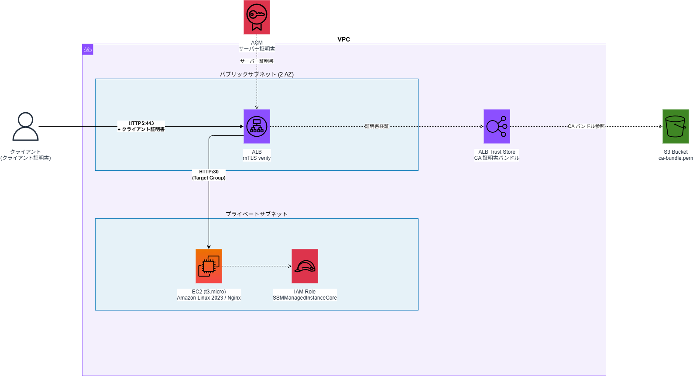

# aws-alb-mtls-sample

AWS ALB の mTLS（Mutual TLS）認証を Terraform で構築する検証用リポジトリです。

## このリポジトリで行うこと

ALB の mTLS verify モードを最小構成で動かし、以下の3パターンを実際に試すことを目的とします。

| パターン | 内容 | 期待結果 |
| --- | --- | --- |
| 証明書あり | Trust Store に登録済み CA が署名した証明書を提示 | 200 OK |
| 証明書なし | クライアント証明書を提示しない | SSL エラー（HTTP 層に到達しない） |
| CA 不一致 | Trust Store に未登録の CA が署名した証明書を提示 | SSL エラー（同上） |

証明書検証の失敗は ALB アクセスログに記録されません。`ClientTLSNegotiationErrorCount` メトリクスと接続ログ（connection logs）で検知する流れも合わせて確認できます。

---

## 構成図



| コンポーネント | 説明 |
| --- | --- |
| クライアント | クライアント証明書を持つリクエスト元 |
| ACM | ALB HTTPS リスナー用サーバー証明書を管理 |
| ALB (mTLS verify) | クライアント証明書を Trust Store で検証し、合格したリクエストのみ転送 |
| ALB Trust Store | 信頼する CA 証明書のバンドルを保持（S3 から読み込み） |
| S3 Bucket | `ca-bundle.pem` の格納先（バージョニング・暗号化有効） |
| EC2 / Nginx | プライベートサブネット内のバックエンド。ALB SG からの HTTP:80 のみ許可 |
| IAM Role | EC2 に付与。SSM Session Manager でのアクセスを可能にする |

### 主なリソース

| リソース | 役割 |
| --- | --- |
| ALB | mTLS verify モードの HTTPS リスナーを持つロードバランサー |
| ALB Trust Store | 信頼する CA 証明書のバンドルを管理 |
| S3 Bucket | CA バンドル PEM ファイルの格納先（バージョニング有効） |
| EC2 (t3.micro) | Nginx を起動するバックエンドターゲット |
| IAM Role | EC2 が SSM Session Manager 経由で操作できるよう付与 |

---

## 前提条件

- Terraform >= 1.10
- AWS CLI（認証済み）
- OpenSSL

---

## 使い方

### 1. 証明書の準備

```bash
mkdir key

# サーバー証明書（ACM にインポート）
openssl genrsa -out key/server.key 2048
openssl req -x509 -new -nodes -key key/server.key -sha256 -days 365 \
  -subj "/CN=mtls-sample.example.com" -out key/server.crt
aws acm import-certificate \
  --certificate fileb://key/server.crt \
  --private-key fileb://key/server.key \
  --region ap-northeast-1
  --profile <my-profile>

# Root CA とクライアント証明書
openssl genrsa -out key/ca.key 2048
openssl req -x509 -new -nodes -key key/ca.key -sha256 -days 3650 \
  -subj "/CN=Test Root CA" -out key/ca.crt

openssl genrsa -out client.key 2048
openssl req -new -key client.key -subj "/CN=test-client" -out client.csr
openssl x509 -req -in client.csr -CA key/ca.crt -CAkey key/ca.key \
  -CAcreateserial -days 365 -sha256 -out client.crt
```

### 2. CA バンドルをローカルに配置

```bash
cp key/ca.crt key/ca-bundle.pem
```

### 3. Terraform

```bash
cd terraform

cp terraform.tfvars.example terraform.tfvars
# terraform.tfvars に vpc_id / subnet ids / certificate_arn / ca_bundle_s3_bucket を設定
# ca_bundle_local_path はデフォルト値 "../key/ca-bundle.pem" で動作します

terraform init
terraform apply
```

`terraform apply` 時に S3 バケットの作成 → CA バンドルのアップロード → Trust Store の作成が自動的に順序どおり実行されます。

### 4. 動作確認

```bash
. ../scripts/operation-confirmation.sh

ALB_DNS=$(terraform output -raw alb_dns_name)

# 証明書あり → 200 OK
curl -k --cert key/client.crt --key key/client.key https://$ALB_DNS/

# 証明書なし → SSL エラー
curl -k https://$ALB_DNS/

# CA 不一致 → SSL エラー
curl -k --cert key/other-ca-client.crt --key key/other-ca-client.key https://$ALB_DNS/
```

---

## 作成リソースの削除

```bash
terraform destroy
```
